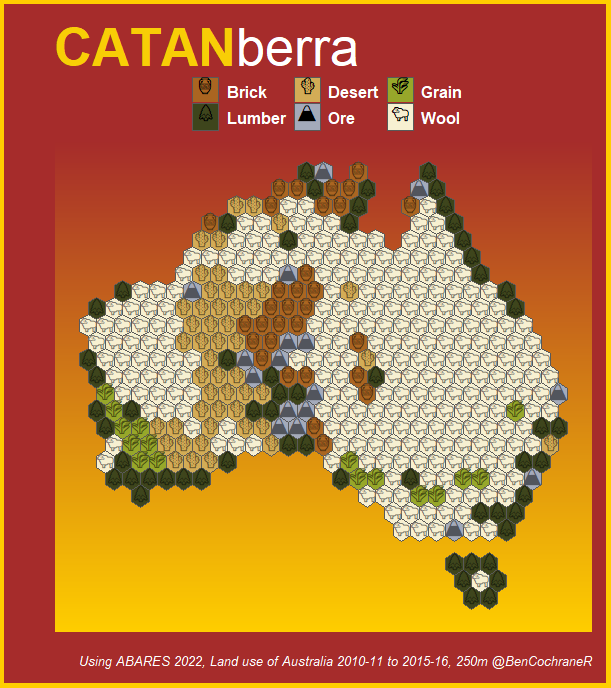

# Generates a map of Australia in the style of Catan.

Uses Australian land use 2015-16 satellite data from ![agriculture] (https://www.agriculture.gov.au/abares/aclump/land-use/land-use-of-australia-2010-11_2015-16)

